# Documentation
It shows you the full documentation of the application and the Blockchain.

## Blockchain
The domain model of the data in the Blockchain is: 
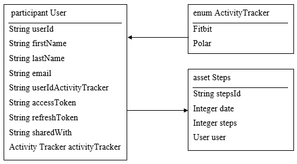

For the different Transactions it is defined what parameters they need to fulfil the task.

To update steps: 
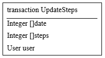
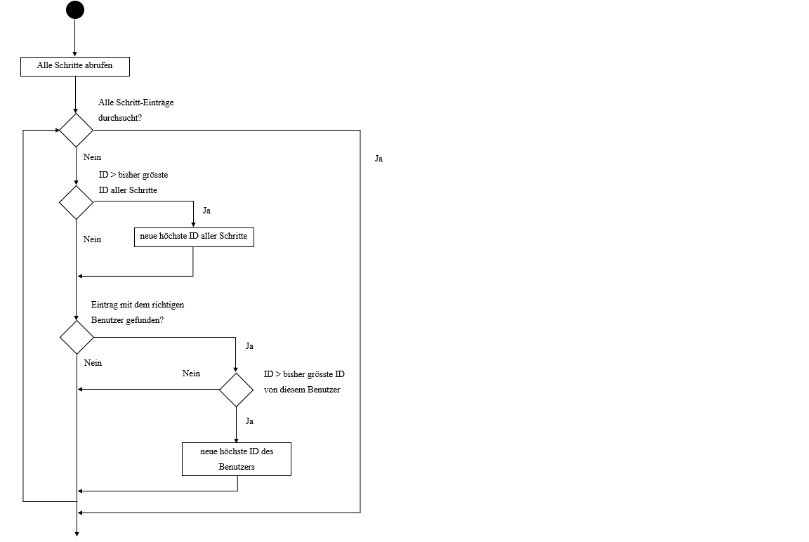
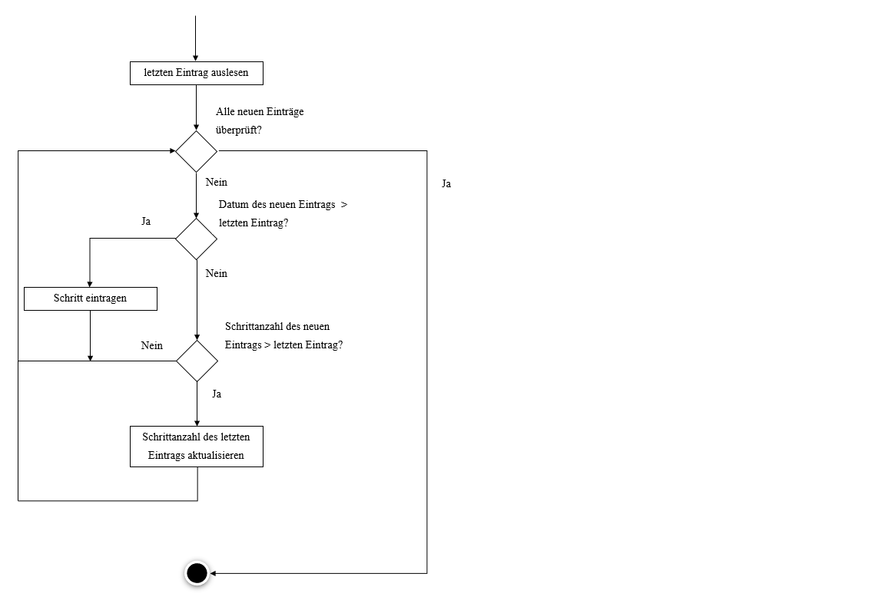

To get steps from a user: 
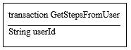

To update the tokens: 
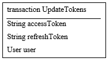
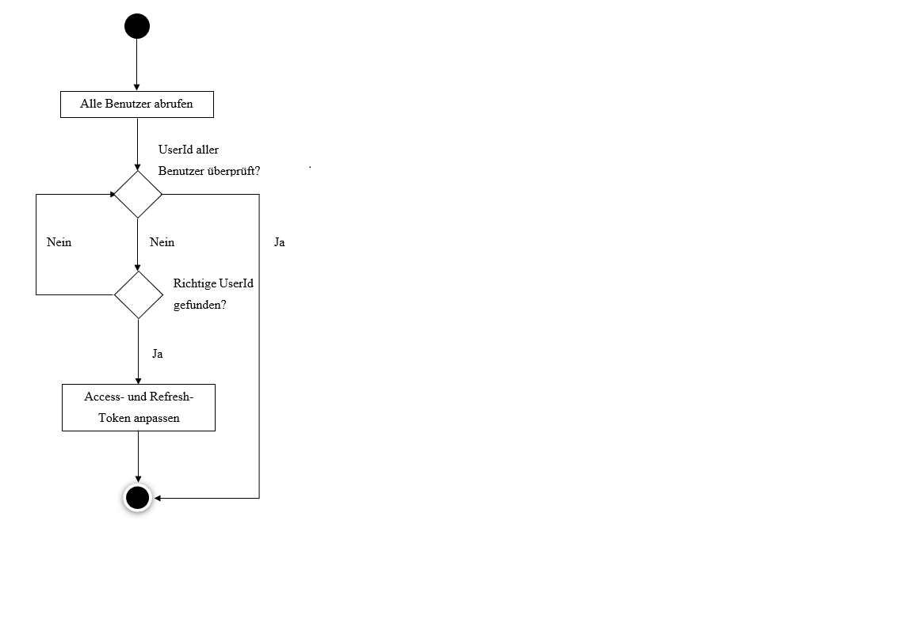

To change the manufacturer of the Activity Tracker: 
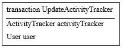
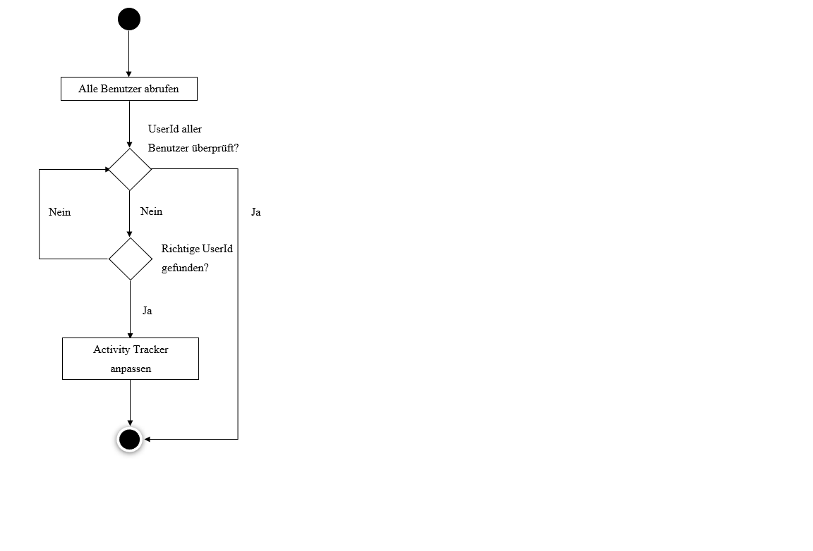

To add with who I share my data: 
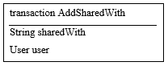
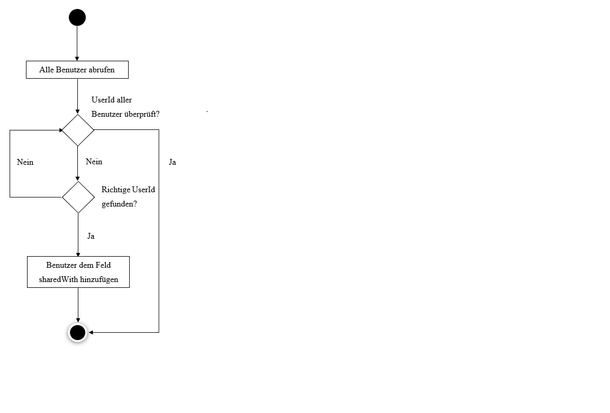

To remove with who I share my data: 
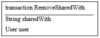
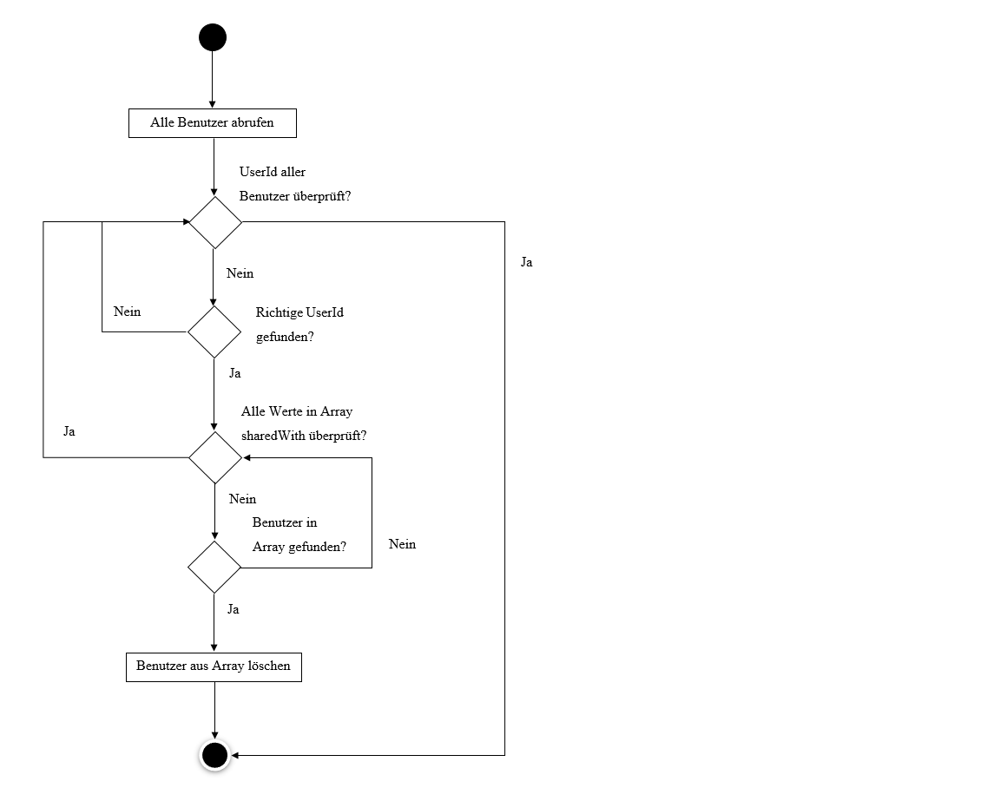

To document the API there is a [.yaml file](doku_API_Blockchain.yaml).

## Application
The application has two parts. The First one get the data from Fitbit or Polar and shows it in the browser. The second one takes the data from Fitbit or Polar put it into the Blockchain and then get the Data from there and shows it in the fronted in a [Chart.js](https://www.chartjs.org/).
The first Part is manly to authorise the application and get the required tokens. Given to the fact, that it is only a prototype this token need to be copied into the Blockchain manually.
The authorisation process follows the following procedure: 
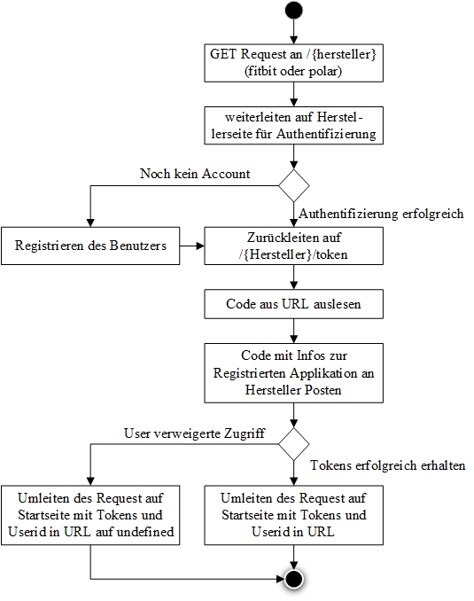

To decide the manufacturer the application follows:  
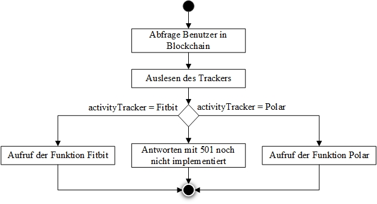

It now can follow the [Fitbit procedure](images/fitbit.jpg) or the [Polar procedures](images/polar.jpg).

For the return format and the structure needed to make request to the application is a [.yaml File](doku_API_Application.yaml) defined.
